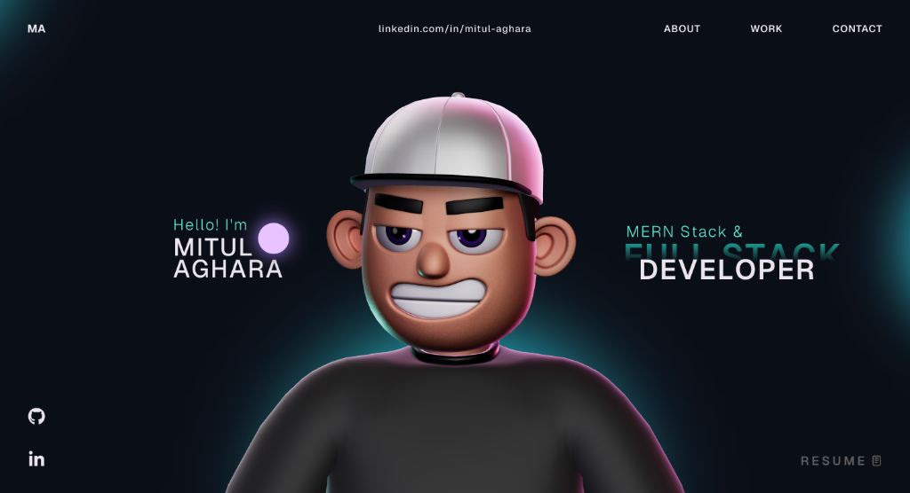

<div align="center">
  <h1>✨ 3D Interactive Web Portfolio ✨</h1>
  <h3>Designed & Developed by <a href="https://github.com/mitulaghara">Mitul Aghara</a></h3>

  <p>
    
    
    
    
  </p>
  <p>
    A visually stunning, personal portfolio demonstrating dynamic 3D interactions, sleek typography, and cutting-edge frontend web technologies. 
  </p>
</div>

&nbsp;

## 🚀 Welcome to My Universe


Hi, I'm **Mitul Aghara**! 👋 I am a passionate developer with a deep focus on creating high-performance, robust applications. I specialize in building scalable web applications using the MERN stack—translating complex logic into intuitive and beautifully designed user experiences.

This repository is home to my personalized 3D Interactive Portfolio.

---

## 💎 Features

- **Immersive 3D Graphics**: Integrated visually appealing interactive 3D elements.
- **Modern UI Aesthetic**: Uses a clean, vibrant color palette with glassmorphism touches.
- **Smooth Animations**: High-performance framer motion transitions across different sections.
- **Fully Responsive**: Crafted to look perfect on desktops, tablets, and mobile devices.
- **Dynamic Projects Showcase**: Beautifully laid-out presentation of highlighted GitHub projects.

---

## 🛠 Tech Stack

- **Framework**: [React](https://reactjs.org/) + [Vite](https://vitejs.dev/)
- **Language**: [TypeScript](https://www.typescriptlang.org/)
- **Styling**: Vanilla CSS with modern utility practices
- **Animations**: [GSAP](https://greensock.com/gsap/) / Custom Hooks

---

## 📦 Projects Highlighted

Here are a few notable projects seamlessly integrated into the portfolio:

| **Project Name** | **Tech Focus** | **Description** |
| :--- | :--- | :--- |
| **[Village Connect](https://villageconnect-am.vercel.app/)** | `React + Node` | A modern village community connect platform. |
| **[Perfume Store](https://github.com/mitulaghara/perfume-store-using-mernstack)** | `MERN Stack` | Sophisticated E-Commerce platform for luxury fragrances. |
| **[Library Management](https://github.com/mitulaghara/Library-Management-System-Using-Mern-Stack)** | `MERN Stack` | Robust dashboard metric tracking and inventory tool. |

---

## ⚙️ Running Locally

1. **Clone the repository**
   ```bash
   git clone https://github.com/mitulaghara/3D-portfolio-Using-React.git
   cd 3D-portfolio-Using-React/3d-portfolio
   ```

2. **Install dependencies**
   ```bash
   npm install
   ```

3. **Spin up the dev server**
   ```bash
   npm run dev
   ```
4. **View your site** 
   Open `http://localhost:5173` to see it in action!

---

## 🤝 Let's Connect!

I am always open to discussing new projects, creative ideas, or opportunities to be part of your visions.

- **LinkedIn**: [mitul-aghara](https://www.linkedin.com/in/mitul-aghara-602a72332/)
- **GitHub**: [@mitulaghara](https://github.com/mitulaghara)

<br/>
<div align="center">
  <sub>Built with ❤️ by Mitul Aghara • © 2026</sub>
</div>
